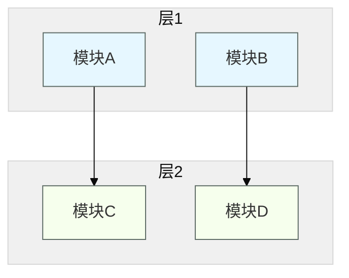
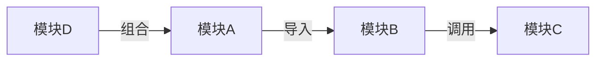
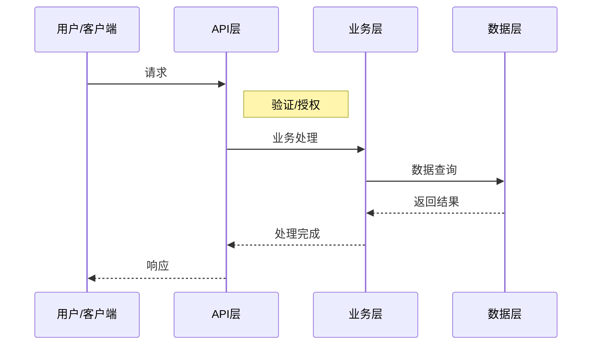

# 代码理解文档模板

> 此模板用于 codebase-explainer skill 的文档输出结构参考

**目录**：
1. 文档头部模板
2. 概览层模板
3. 结构层模板
4. 流程层模板
5. API 层模板
6. 开发指南模板

---

## 1. 文档头部模板

```markdown
---
generated_at: {{timestamp}}
source_identifier:
  type: {{git|directory}}
  commit: {{commit_hash}}
  branch: {{branch_name}}
---

# {{项目名}} 代码理解文档

> ⚠️ 此文档生成于上述版本，如代码有变更请重新运行 `/codebase-explainer`
```

**填充要点说明：**
- `generated_at`: 使用 ISO 8601 格式时间戳（如 `2026-05-21T10:30:00Z`）
- `source_identifier.type`: 从 git 仓库生成填 `git`，从普通目录生成填 `directory`
- `commit`: Git commit hash（64位），非 git 目录可留空
- `branch`: 当前 git 分支名，非 git 目录可留空
- `项目名`: 从 `package.json`、`Cargo.toml`、`go.mod` 等配置文件中提取

---

## 2. 概览层模板

### 一句话定位

```markdown
{{项目名}} 是一个{{描述项目核心功能的单句，不超过 50 字}}
```

**填充要点：**
- 抓住项目最核心的职责
- 说明解决的主要问题
- 保持一句话简洁明了

### 技术栈表格

```markdown
| 类别 | 技术栈 |
|------|--------|
| 核心语言 | {{语言列表}} |
| 框架 | {{框架列表}} |
| 数据库 | {{数据库列表}} |
| 格式 | {{格式列表}} |
| 工具链 | {{工具链列表}} |
```

**填充要点：**
- 通过文件扩展名、配置文件、导入语句识别技术栈
- 区分运行时依赖和开发依赖
- 多语言项目需列出所有主要语言

### 架构图（Mermaid）



**填充要点：**
- 按分层架构或模块依赖关系绘制
- 顶层用主色调（蓝色系）
- 下层用辅助色（绿色系）
- 每层不超过 5 个模块

---

## 3. 结构层模板

### 目录职责树

```markdown
{{项目根目录}}/
├── {{目录1}}/           # {{职责说明}}
│   ├── {{子目录1}}/     # {{职责说明}}
│   │   └── {{文件1}}    # {{职责说明}}
│   └── {{子目录2}}/     # {{职责说明}}
├── {{目录2}}/           # {{职责说明}}
└── {{配置文件}}         # {{职责说明}}
```

**填充要点：**
- 从 `tree` 命令输出或手动探索目录结构
- 每个节点用注释说明职责
- 标注关键配置文件职责

### 模块边界表格

```markdown
| 模块 | 职责 | 主要入口 | 依赖模块 |
|------|------|----------|----------|
| {{模块名}} | {{职责描述}} | {{入口文件/函数}} | {{依赖列表}} |
```

**填充要点：**
- 明确_each_模块的单一职责
- 标注.public API 作为入口
- 建立模块间依赖关系映射

### 依赖关系图



**填充要点：**
- 标注依赖类型（导入/调用/组合/继承）
- 识别循环依赖警告
- 区分同步依赖和异步依赖

---

## 4. 流程层模板

### 核心业务流程（sequenceDiagram）



**填充要点：**
- 识别关键用户场景（创建/查询/更新/删除）
- 标注每个环节的处理逻辑
- 包含异常处理路径（可选）

### 数据流向表格

```markdown
| 阶段 | 输入 | 处理逻辑 | 输出 |
|------|------|----------|------|
| {{阶段1}} | {{输入数据}} | {{处理方式}} | {{输出数据}} |
| {{阶段2}} | {{输入数据}} | {{处理方式}} | {{输出数据}} |
```

**填充要点：**
- 追踪数据从输入到输出的完整链路
- 标注每个环节的数据转换
- 包含数据存储和缓存环节

### 关键调用链

```markdown
1. {{入口函数}}
   └── 2. {{调用函数1}}
       └── 3. {{调用函数2}}
           └── 4. {{底层操作}}
```

**填充要点：**
- 展示完整的函数调用栈
- 标注异步调用和并行调用
- 包含外部依赖调用（API/DB/文件）

---

## 5. API 层模板

### 公开接口表格

```markdown
| 接口 | 方法 | 描述 | 输入 | 输出 |
|------|------|------|------|------|
| {{路径}} | {{HTTP 方法}} | {{描述}} | {{参数说明}} | {{返回类型}} |
```

**填充要点：**
- 列出所有公开的 REST/grpc/WebSocket 接口
- 标注权限要求
- 包含接口的版本信息（如有）

### 数据模型定义

```markdown
#### {{模型名}}

| 字段 | 类型 | 必填 | 描述 |
|------|------|------|------|
| {{字段1}} | {{类型}} | 是/否 | {{说明}} |
| {{字段2}} | {{类型}} | 是/否 | {{说明}} |

```json
{
  "{{字段1}}": "{{示例值}}",
  "{{字段2}}": {{示例值}}
}
```

**填充要点：**
- 识别所有 DTO/Model/Entity 类型
- 标注字段类型和约束
- 提供默认值和示例值

### 配置项表格

```markdown
| 配置项 | 类型 | 默认值 | 说明 |
|--------|------|--------|------|
| {{ENV_KEY}} | {{类型}} | {{默认值}} | {{描述}} |
```

**填充要点：**
- 环境变量配置
- 配置文件配置项
- 配置验证规则（如有）

---

## 6. 开发指南模板

### 环境搭建步骤

```markdown
1. 克隆代码
   ```bash
   git clone {{仓库地址}}
   cd {{项目名}}
   ```

2. 安装依赖
   ```bash
   {{安装命令}}
   ```

3. 配置环境
   ```bash
   cp .env.example .env
   # 编辑 .env
   ```

4. 启动服务
   ```bash
   {{启动命令}}
   ```

**填充要点：**
- 按实际项目步骤调整
- 包含验证步骤
- 标注可选配置项

### 常用命令表格

```markdown
| 命令 | 说明 |
|------|------|
| {{npm/yarn/make}} {{command}} | {{说明}} |
| {{后端命令}} | {{说明}} |
| {{前端命令}} | {{说明}} |
```

**填充要点：**
- 构建、测试、运行、调试命令
- 代码生成命令（如有）
- 项目特定脚本

### 常见问题/陷阱

```markdown
#### {{问题标题}}

**现象**：{{具体描述}

**原因**：{{根本原因}

**解决方案**：{{解决步骤}

#### {{问题标题}}

**现象**：{{具体描述}

**原因**：{{根本原因}

**解决方案**：{{解决步骤}
```

**填充要点：**
- 从 README/ISSUES/PR 中提取
- 记录偶发但影响大的问题
- 包含验证解决方案的步骤
